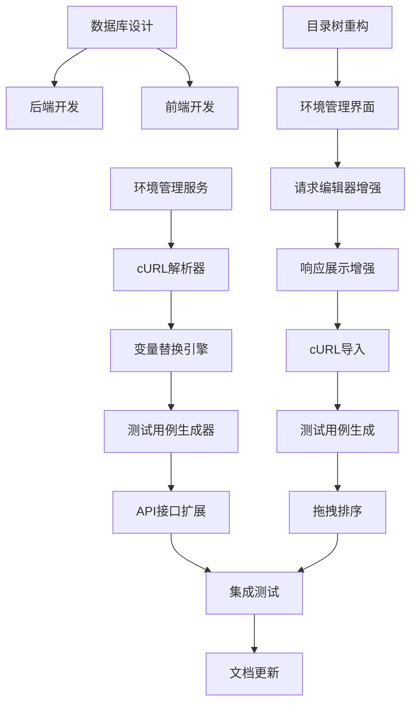

# 接口管理模块重构 - 任务清单

> 文档版本: v1.0
> 创建日期: 2025-02-11
> 角色: 系统架构师

---

## 1. WBS 工作分解结构

```
接口管理模块重构
├── 1. 数据库设计
│   ├── 1.1 新增接口历史记录表
│   ├── 1.2 新增接口测试用例表
│   ├── 1.3 扩展环境表字段
│   └── 1.4 生成并执行数据库迁移
│
├── 2. 后端开发
│   ├── 2.1 环境管理服务
│   ├── 2.2 cURL 解析器
│   ├── 2.3 变量替换引擎
│   ├── 2.4 测试用例生成器
│   ├── 2.5 API 接口扩展
│   └── 2.6 单元测试
│
├── 3. 前端开发
│   ├── 3.1 左侧目录树重构
│   ├── 3.2 环境管理界面
│   ├── 3.3 请求编辑器增强
│   ├── 3.4 响应展示增强
│   ├── 3.5 cURL 导入功能
│   ├── 3.6 测试用例生成界面
│   └── 3.7 拖拽排序功能
│
└── 4. 集成测试
    ├── 4.1 API 测试
    ├── 4.2 E2E 测试
    └── 4.3 性能测试
```

---

## 2. 数据库设计任务

### 1.1 新增接口历史记录表

| 任务 ID | 描述 | 估时 | 依赖 |
|--------|------|------|------|
| DB-01 | 创建 `InterfaceHistory` 模型 | 1h | - |
| DB-02 | 创建历史记录 Pydantic Schema | 0.5h | DB-01 |
| DB-03 | 生成 Alembic 迁移脚本 | 0.5h | DB-02 |

**交付物：**
- `backend/app/models/interface_history.py`
- `backend/app/schemas/interface_history.py`
- `backend/alembic/versions/xxx_add_interface_history.py`

### 1.2 新增接口测试用例表

| 任务 ID | 描述 | 估时 | 依赖 |
|--------|------|------|------|
| DB-04 | 创建 `InterfaceTestCase` 模型 | 1h | - |
| DB-05 | 创建测试用例 Pydantic Schema | 0.5h | DB-04 |
| DB-06 | 生成 Alembic 迁移脚本 | 0.5h | DB-05 |

**交付物：**
- `backend/app/models/interface_test_case.py`
- `backend/app/schemas/interface_test_case.py`
- `backend/alembic/versions/xxx_add_interface_test_case.py`

### 1.3 扩展环境表字段

| 任务 ID | 描述 | 估时 | 依赖 |
|--------|------|------|------|
| DB-07 | 为 `ProjectEnvironment` 添加 `is_preupload` 字段 | 0.5h | - |
| DB-08 | 生成迁移脚本 | 0.5h | DB-07 |

### 1.4 执行迁移

| 任务 ID | 描述 | 估时 | 依赖 |
|--------|------|------|------|
| DB-09 | 执行所有迁移脚本 | 0.5h | DB-03, DB-06, DB-08 |

---

## 3. 后端开发任务

### 2.1 环境管理服务

| 任务 ID | 描述 | 估时 | 依赖 |
|--------|------|------|------|
| BE-01 | 创建 `EnvironmentService` 类 | 2h | - |
| BE-02 | 实现环境 CRUD 操作 | 2h | BE-01 |
| BE-03 | 实现环境克隆功能 | 1h | BE-02 |
| BE-04 | 实现环境变量替换逻辑 | 3h | BE-02 |
| BE-05 | 创建环境管理 API 路由 | 2h | BE-02 |
| BE-06 | 环境管理单元测试 | 2h | BE-05 |

**交付物：**
- `backend/app/services/environment_service.py`
- `backend/app/api/v1/endpoints/environments.py`
- `backend/tests/services/test_environment_service.py`

### 2.2 cURL 解析器

| 任务 ID | 描述 | 估时 | 依赖 |
|--------|------|------|------|
| BE-07 | 创建 `CurlParser` 类 | 2h | - |
| BE-08 | 实现基础 cURL 命令解析 | 3h | BE-07 |
| BE-09 | 实现 Headers/Body/Params 提取 | 2h | BE-08 |
| BE-10 | 实现认证类型识别 | 2h | BE-08 |
| BE-11 | 创建 cURL 解析 API | 1h | BE-10 |
| BE-12 | cURL 解析器单元测试 | 2h | BE-11 |

**交付物：**
- `backend/app/services/curl_parser.py`
- `backend/app/api/v1/endpoints/interfaces.py` (扩展)
- `backend/tests/services/test_curl_parser.py`

### 2.3 变量替换引擎

| 任务 ID | 描述 | 估时 | 依赖 |
|--------|------|------|------|
| BE-13 | 创建 `VariableReplacer` 类 | 1h | - |
| BE-14 | 实现 `{{变量}}` 语法解析 | 2h | BE-13 |
| BE-15 | 实现环境变量替换 | 2h | BE-14 |
| BE-16 | 实现系统变量 (`{{$timestamp}}` 等) | 2h | BE-14 |
| BE-17 | 变量替换单元测试 | 2h | BE-16 |

**交付物：**
- `backend/app/services/variable_replacer.py`
- `backend/tests/services/test_variable_replacer.py`

### 2.4 测试用例生成器

| 任务 ID | 描述 | 估时 | 依赖 |
|--------|------|------|------|
| BE-18 | 创建 `TestCaseGenerator` 类 | 1h | - |
| BE-19 | 实现 YAML 生成逻辑 | 3h | BE-18 |
| BE-20 | 实现断言自动生成 | 2h | BE-19 |
| BE-21 | 实现关键字生成逻辑 | 2h | BE-18 |
| BE-22 | 创建测试用例生成 API | 1h | BE-20 |
| BE-23 | 测试用例生成器单元测试 | 2h | BE-22 |

**交付物：**
- `backend/app/services/test_case_generator.py`
- `backend/app/api/v1/endpoints/interfaces.py` (扩展)
- `backend/tests/services/test_test_case_generator.py`

### 2.5 API 接口扩展

| 任务 ID | 描述 | 估时 | 依赖 |
|--------|------|------|------|
| BE-24 | 扩展接口更新 API | 1h | - |
| BE-25 | 创建请求历史记录 API | 2h | DB-03 |
| BE-26 | 创建接口移动 API | 1h | - |
| BE-27 | 创建接口复制 API | 1h | - |
| BE-28 | 添加分页/搜索/过滤 | 2h | BE-24 |

### 2.6 单元测试

| 任务 ID | 描述 | 估时 | 依赖 |
|--------|------|------|------|
| BE-29 | 后端集成测试 | 4h | 所有后端任务 |

**交付物：**
- `backend/tests/api/v1/test_interfaces_enhanced.py`

---

## 4. 前端开发任务

### 3.1 左侧目录树重构（P0 - MVP 包含拖拽）

| 任务 ID | 描述 | 估时 | 依赖 |
|--------|------|------|------|
| FE-01 | 安装拖拽库 (@dnd-kit) | 0.5h | - |
| FE-02 | 创建 `InterfaceTree` 组件 | 3h | FE-01 |
| FE-03 | 实现树形展示逻辑 | 2h | FE-02 |
| FE-04 | 实现右键菜单 | 2h | FE-03 |
| FE-05 | 实现搜索过滤 | 2h | FE-03 |
| FE-06 | 实现展开/折叠状态持久化 | 1h | FE-03 |
| FE-07 | **实现拖拽排序（P0）** | 3h | FE-02 |
| FE-08 | **实现跨文件夹移动（P0）** | 2h | FE-07 |

**交付物：**
- `frontend/src/pages/interface/components/InterfaceTree.tsx`
- `frontend/src/pages/interface/components/ContextMenu.tsx`

> **用户决策**：拖拽功能在 MVP 第一阶段实现，不需要延后

### 3.2 环境管理界面

| 任务 ID | 描述 | 估时 | 依赖 |
|--------|------|------|------|
| FE-09 | 创建 `EnvironmentSelector` 组件 | 2h | - |
| FE-10 | 创建 `EnvironmentDialog` 组件 | 4h | FE-09 |
| FE-11 | 实现环境切换逻辑 | 2h | FE-10 |
| FE-12 | 实现环境变量编辑器 | 2h | FE-10 |
| FE-13 | 实现环境克隆/删除 | 1h | FE-10 |

**交付物：**
- `frontend/src/pages/interface/components/EnvironmentSelector.tsx`
- `frontend/src/pages/interface/dialogs/EnvironmentDialog.tsx`

### 3.3 请求编辑器增强

| 任务 ID | 描述 | 估时 | 依赖 |
|--------|------|------|------|
| FE-14 | 创建 `RequestEditor` 容器组件 | 2h | - |
| FE-15 | 创建 `MethodSelector` 组件 | 1h | FE-14 |
| FE-16 | 创建 `UrlInput` 组件 | 2h | FE-14 |
| FE-17 | 创建 `ParamsTab` 组件 | 3h | FE-14 |
| FE-18 | 创建 `AuthTab` 组件 | 4h | FE-14 |
| FE-19 | 创建 `HeadersTab` 组件 | 2h | FE-17 |
| FE-20 | 创建 `BodyTab` 组件 | 4h | FE-14 |
| FE-21 | 创建 `KeyValueEditor` 通用组件 | 3h | FE-17 |
| FE-22 | ~~创建 `PreRequestTab` 组件~~ | ~~2h~~ | **暂不实现** |

**交付物：**
- `frontend/src/pages/interface/components/RequestEditor/`
- `frontend/src/pages/interface/components/RequestEditor/KeyValueEditor.tsx`

> **用户决策**：Pre-request Script 暂不实现，可预留 UI 入口

### 3.4 响应展示增强

| 任务 ID | 描述 | 估时 | 依赖 |
|--------|------|------|------|
| FE-23 | 创建 `ResponseViewer` 容器组件 | 2h | - |
| FE-24 | 创建 `BodyViewer` 组件 | 2h | FE-23 |
| FE-25 | 创建 `HeadersViewer` 组件 | 1h | FE-23 |
| FE-26 | 创建 `CookiesViewer` 组件 | 1h | FE-23 |
| FE-27 | 创建 `TimelineViewer` 组件 | 3h | FE-23 |
| FE-28 | **实现执行日志展开/收起** | 1h | FE-23 |

**交付物：**
- `frontend/src/pages/interface-refactor/components/ResponseViewer/` ✅
- `frontend/src/pages/interface-refactor/components/ResponseViewer/ExecutionLogViewer.tsx` ⚠️ 待创建

> **用户决策**：执行日志默认隐藏，支持展开/收起交互
> **实现状态**：基础响应展示已完成，执行日志展开功能待补充（FE-28 待实现）

### 3.5 cURL 导入功能

| 任务 ID | 描述 | 估时 | 依赖 |
|--------|------|------|------|
| FE-27 | 创建 `CurlImportDialog` 组件 | 3h | BE-12 |
| FE-28 | 实现 cURL 粘贴和解析 | 2h | FE-27 |
| FE-29 | 实现解析结果预览 | 2h | FE-28 |
| FE-30 | 实现导入到编辑器 | 1h | FE-29 |

**交付物：**
- `frontend/src/pages/interface/dialogs/CurlImportDialog.tsx`

### 3.6 测试用例生成界面

| 任务 ID | 描述 | 估时 | 依赖 |
|--------|------|------|------|
| FE-31 | 创建 `GenerateCaseDialog` 组件 | 3h | BE-23 |
| FE-32 | 实现测试用例配置表单 | 2h | FE-31 |
| FE-33 | 实现断言配置 | 2h | FE-32 |

**交付物：**
- `frontend/src/pages/interface/dialogs/GenerateCaseDialog.tsx`

### 3.7 拖拽排序功能（已移至 3.1，P0 优先级）

> **注意**：拖拽功能已在 3.1 中作为 P0 任务实现，此章节已合并到 3.1。

### 3.8 欢迎卡片

| 任务 ID | 描述 | 估时 | 依赖 |
|--------|------|------|------|
| FE-37 | 创建 `WelcomeCards` 组件 | 2h | - |
| FE-38 | 实现最近使用接口列表 | 2h | FE-37 |

**交付物：**
- `frontend/src/pages/interface/components/WelcomeCards.tsx`

### 3.9 自定义 Hooks

| 任务 ID | 描述 | 估时 | 依赖 |
|--------|------|------|------|
| FE-29 | 创建 `useVariableReplacement` Hook | 2h | BE-17 |
| FE-30 | 创建 `useRequestHistory` Hook | 2h | BE-25 |
| FE-31 | 创建 `useEnvironment` Hook | 2h | BE-06 |

**交付物：**
- `frontend/src/pages/interface/hooks/useVariableReplacement.ts`
- `frontend/src/pages/interface/hooks/useRequestHistory.ts`
- `frontend/src/pages/interface/hooks/useEnvironment.ts`

---

## 5. 集成测试任务

### 4.1 API 测试

| 任务 ID | 描述 | 估时 | 依赖 |
|--------|------|------|------|
| QA-01 | 环境管理 API 测试 | 2h | BE-06 |
| QA-02 | cURL 解析 API 测试 | 2h | BE-12 |
| QA-03 | 测试用例生成 API 测试 | 2h | BE-23 |
| QA-04 | 变量替换 API 测试 | 2h | BE-17 |

**交付物：**
- `backend/tests/api/v1/test_environments.py`
- `backend/tests/api/v1/test_curl_parsing.py`

### 4.2 E2E 测试

| 任务 ID | 描述 | 估时 | 依赖 |
|--------|------|------|------|
| QA-05 | 接口创建流程 E2E 测试 | 3h | FE-14 |
| QA-06 | 环境切换流程 E2E 测试 | 2h | FE-11 |
| QA-07 | cURL 导入流程 E2E 测试 | 2h | FE-30 |
| QA-08 | 测试用例生成流程 E2E 测试 | 3h | FE-33 |

**交付物：**
- `frontend/e2e/interface-management.spec.ts`

### 4.3 性能测试

| 任务 ID | 描述 | 估时 | 依赖 |
|--------|------|------|------|
| QA-09 | 接口列表加载性能测试 | 2h | QA-01 |
| QA-10 | 变量替换性能测试 | 2h | BE-17 |
| QA-11 | cURL 解析性能测试 | 1h | BE-12 |

---

## 6. 文档任务

| 任务 ID | 描述 | 估时 | 依赖 |
|--------|------|------|------|
| DOC-01 | 更新 API 文档 | 2h | 所有 BE 任务 |
| DOC-02 | 编写组件使用文档 | 2h | 所有 FE 任务 |
| DOC-03 | 编写部署指南 | 1h | QA-05 |

---

## 7. 任务依赖关系图



---

## 8. 里程碑

| 里程碑 | 交付日期 | 交付内容 |
|--------|----------|----------|
| M1: 数据库设计完成 | Day 2 | 所有数据库迁移脚本执行完成 |
| M2: 后端核心服务完成 | Day 6 | 环境管理、cURL 解析、变量替换完成 |
| M3: 前端核心界面完成 | Day 12 | 目录树、请求编辑器、响应展示完成 |
| M4: 功能集成完成 | Day 16 | cURL 导入、测试用例生成完成 |
| M5: 测试与文档完成 | Day 20 | 所有测试通过，文档更新完成 |

---

## 9. 估时汇总

| 阶段 | 估时 (人日) | 变更说明 |
|------|-------------|----------|
| 数据库设计 | 1 | 无变更 |
| 后端开发 | 10 | 无变更 |
| 前端开发 | 14 | 减 1 人日（Pre-request Script 取消） |
| 集成测试 | 4 | 无变更 |
| 文档 | 1 | 无变更 |
| **总计** | **30 人日** | **减少 1 人日** |

### 变更说明

**已移除任务：**
- ~~FE-22: PreRequestTab 组件~~ - 用户决定暂不实现前置脚本功能

**优先级调整：**
- FE-07/08: 拖拽排序从 P2 升级为 P0，在 MVP 第一阶段实现
- FE-28: 新增执行日志展开/收起功能（按需显示）

**新增任务：**
- FE-28: 实现执行日志展开/收起交互（1h）

---

## 10. 用户决策记录

### 决策 1：拖拽功能优先级

| 项目 | 内容 |
|------|------|
| 决策时间 | 2025-02-11 |
| 决策内容 | 拖拽排序和跨文件夹移动在 MVP 第一阶段实现 |
| 影响 | FE-07/08 优先级从 P2 升级为 P0 |
| 理由 | 用户需要完整的接口组织功能 |

### 决策 2：Pre-request Script 功能

| 项目 | 内容 |
|------|------|
| 决策时间 | 2025-02-11 |
| 决策内容 | 暂不实现前置脚本功能，后续有需求再实现 |
| 影响 | 移除 FE-22 任务，减少 2h 开发时间 |
| 备注 | 可预留 UI 入口 |

### 决策 3：执行日志显示方式

| 项目 | 内容 |
|------|------|
| 决策时间 | 2025-02-11 |
| 决策内容 | 执行日志按需显示，默认隐藏 |
| 影响 | 新增 FE-28 任务（1h），实现展开/收起交互 |
| 理由 | 简化默认界面，用户需要时可查看详情 |

---

**文档版本**：v1.2 (添加待集成事项)
**最后更新**：2025-02-11

## 11. 待集成事项

### 11.1 前端集成

| 任务 | 描述 | 负责人 | 状态 |
|------|------|--------|------|
| FE-INT-01 | 在 App.tsx 中添加 `/interfaces-refactor` 路由 | Frontend | ⚠️ 待添加 |
| FE-INT-02 | 在侧边栏中添加导航入口 | Frontend | ⚠️ 待添加 |
| FE-28 | 实现执行日志展开/收起功能 | Frontend | ⚠️ 待实现 |

### 11.2 后端集成

| 任务 | 描述 | 负责人 | 状态 |
|------|------|--------|------|
| BE-INT-01 | 执行数据库迁移脚本 | Backend | ⚠️ 待执行 |
| BE-INT-02 | API 接口联调测试 | Backend + Frontend | ⚠️ 待执行 |
| BE-INT-03 | 变量替换功能测试 | QA | ⚠️ 待测试 |

### 11.3 路由配置示例

在 `frontend/src/App.tsx` 中添加：

```tsx
import InterfaceRefactorPage from '@/pages/interface-refactor'

// 在路由中添加
<Route path="/interfaces-refactor" element={<InterfaceRefactorPage />} />
<Route path="/interfaces-refactor/:id" element={<InterfaceRefactorPage />} />
<Route path="/interfaces-refactor/new" element={<InterfaceRefactorPage />} />
```

### 11.4 导航菜单配置

在 `frontend/src/components/layout/Sidebar.tsx` 中添加导航项：

```tsx
{
  icon: Database,
  label: '接口调试 (新版)',
  path: '/interfaces-refactor',
  badge: 'New'
}
```

