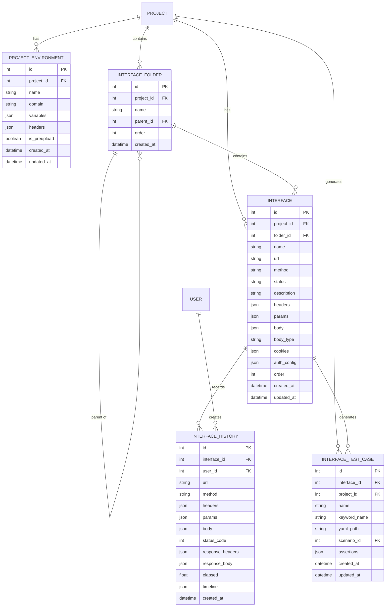

# 接口管理模块重构 - 数据库设计

> 文档版本: v1.0
> 创建日期: 2025-02-11
> 角色: 系统架构师

---

## 1. ER 图



---

## 2. 表结构详细设计

### 2.1 扩展现有表

#### 2.1.1 interfacefolder 表扩展

**新增字段：**

| 字段名 | 类型 | 约束 | 默认值 | 说明 |
|--------|------|------|--------|------|
| order | INTEGER | NOT NULL | 0 | 同级排序序号 |

**迁移脚本：**

```python
# alembic/versions/xxx_add_folder_order.py

from alembic import op
import sqlalchemy as sa
from sqlalchemy.dialects import postgresql, sqlite

# 使用 JSON 类型（兼容 SQLite 和 PostgreSQL）
JSON = sa.JSON()
if op.get_context().dialect.name == 'postgresql':
    JSON = postgresql.JSON()


def upgrade():
    op.add_column('interfacefolder', sa.Column('order', sa.Integer(), nullable=False, server_default='0'))


def downgrade():
    op.drop_column('interfacefolder', 'order')
```

---

#### 2.1.2 interface 表扩展

**新增字段：**

| 字段名 | 类型 | 约束 | 默认值 | 说明 |
|--------|------|------|--------|------|
| order | INTEGER | NOT NULL | 0 | 同级排序序号 |
| auth_config | JSON | NULL | {} | 认证配置 |

**迁移脚本：**

```python
# alembic/versions/xxx_add_interface_auth_and_order.py

from alembic import op
import sqlalchemy as sa
from sqlalchemy.dialects import postgresql, sqlite

# 使用 JSON 类型（兼容 SQLite 和 PostgreSQL）
JSON = sa.JSON()
if op.get_context().dialect.name == 'postgresql':
    JSON = postgresql.JSON()


def upgrade():
    # 添加 order 字段
    op.add_column('interface', sa.Column('order', sa.Integer(), nullable=False, server_default='0'))

    # 添加 auth_config 字段
    op.add_column('interface', sa.Column('auth_config', JSON(), nullable=True, server_default='{}'))


def downgrade():
    op.drop_column('interface', 'auth_config')
    op.drop_column('interface', 'order')
```

---

#### 2.1.3 projectenvironment 表扩展

**新增字段：**

| 字段名 | 类型 | 约束 | 默认值 | 说明 |
|--------|------|------|--------|------|
| is_preupload | BOOLEAN | NOT NULL | FALSE | 是否预上传（未来扩展） |

**迁移脚本：**

```python
# alembic/versions/xxx_add_environment_preupload.py

from alembic import op
import sqlalchemy as sa


def upgrade():
    op.add_column(
        'projectenvironment',
        sa.Column('is_preupload', sa.Boolean(), nullable=False, server_default='0')
    )


def downgrade():
    op.drop_column('projectenvironment', 'is_preupload')
```

---

### 2.2 新增表

#### 2.2.1 interfacehistory 表

**用途：** 记录接口请求历史，支持回溯和调试

**表结构：**

| 字段名 | 类型 | 约束 | 默认值 | 说明 |
|--------|------|------|--------|------|
| id | INTEGER | PK | AUTO | 主键 |
| interface_id | INTEGER | FK | NOT NULL | 关联接口 ID |
| user_id | INTEGER | FK | NOT NULL | 操作用户 ID |
| url | VARCHAR | NOT NULL | - | 请求 URL |
| method | VARCHAR(10) | NOT NULL | - | 请求方法 |
| headers | JSON | NULL | {} | 请求头 |
| params | JSON | NULL | {} | 查询参数 |
| body | JSON | NULL | {} | 请求体 |
| status_code | INTEGER | NULL | - | 响应状态码 |
| response_headers | JSON | NULL | {} | 响应头 |
| response_body | JSON | NULL | {} | 响应体 |
| elapsed | FLOAT | NULL | - | 请求耗时（秒） |
| timeline | JSON | NULL | {} | 时间线数据 |
| created_at | TIMESTAMP | NOT NULL | NOW | 创建时间 |

**索引：**

```sql
CREATE INDEX idx_interface_history_interface_id ON interfacehistory(interface_id);
CREATE INDEX idx_interface_history_user_id ON interfacehistory(user_id);
CREATE INDEX idx_interface_history_created_at ON interfacehistory(created_at DESC);
```

**迁移脚本：**

```python
# alembic/versions/xxx_add_interface_history.py

from alembic import op
import sqlalchemy as sa
from sqlalchemy.dialects import postgresql, sqlite

# 使用 JSON 类型（兼容 SQLite 和 PostgreSQL）
JSON = sa.JSON()
if op.get_context().dialect.name == 'postgresql':
    JSON = postgresql.JSON()


def upgrade():
    op.create_table(
        'interfacehistory',
        sa.Column('id', sa.Integer(), nullable=False),
        sa.Column('interface_id', sa.Integer(), nullable=False),
        sa.Column('user_id', sa.Integer(), nullable=False),
        sa.Column('url', sa.String(), nullable=False),
        sa.Column('method', sa.String(length=10), nullable=False),
        sa.Column('headers', JSON(), nullable=True, server_default='{}'),
        sa.Column('params', JSON(), nullable=True, server_default='{}'),
        sa.Column('body', JSON(), nullable=True, server_default='{}'),
        sa.Column('status_code', sa.Integer(), nullable=True),
        sa.Column('response_headers', JSON(), nullable=True, server_default='{}'),
        sa.Column('response_body', JSON(), nullable=True, server_default='{}'),
        sa.Column('elapsed', sa.Float(), nullable=True),
        sa.Column('timeline', JSON(), nullable=True, server_default='{}'),
        sa.Column('created_at', sa.DateTime(), nullable=False, server_default=sa.func.now()),
        sa.ForeignKeyConstraint(['interface_id'], ['interface.id']),
        sa.ForeignKeyConstraint(['user_id'], ['user.id']),
        sa.PrimaryKeyConstraint('id')
    )

    # 创建索引
    op.create_index('idx_interface_history_interface_id', 'interfacehistory', ['interface_id'])
    op.create_index('idx_interface_history_user_id', 'interfacehistory', ['user_id'])
    op.create_index('idx_interface_history_created_at', 'interfacehistory', ['created_at'])


def downgrade():
    op.drop_index('idx_interface_history_created_at', table_name='interfacehistory')
    op.drop_index('idx_interface_history_user_id', table_name='interfacehistory')
    op.drop_index('idx_interface_history_interface_id', table_name='interfacehistory')
    op.drop_table('interfacehistory')
```

---

#### 2.2.2 interfacetestcase 表

**用途：** 存储从接口生成的测试用例，关联到 sisyphus-api-engine

**表结构：**

| 字段名 | 类型 | 约束 | 默认值 | 说明 |
|--------|------|------|--------|------|
| id | INTEGER | PK | AUTO | 主键 |
| interface_id | INTEGER | FK | NOT NULL | 关联接口 ID |
| project_id | INTEGER | FK | NOT NULL | 关联项目 ID |
| name | VARCHAR(100) | NOT NULL | - | 测试用例名称 |
| keyword_name | VARCHAR(100) | NOT NULL | - | 关键字函数名 |
| yaml_path | VARCHAR(255) | NOT NULL | - | YAML 文件相对路径 |
| scenario_id | INTEGER | FK | NULL | 所属场景 ID |
| assertions | JSON | NULL | {} | 断言配置 |
| created_at | TIMESTAMP | NOT NULL | NOW | 创建时间 |
| updated_at | TIMESTAMP | NOT NULL | NOW | 更新时间 |

**索引：**

```sql
CREATE INDEX idx_interface_test_case_interface_id ON interfacetestcase(interface_id);
CREATE INDEX idx_interface_test_case_project_id ON interfacetestcase(project_id);
CREATE UNIQUE INDEX idx_interface_test_case_yaml_path ON interfacetestcase(yaml_path);
```

**迁移脚本：**

```python
# alembic/versions/xxx_add_interface_test_case.py

from alembic import op
import sqlalchemy as sa
from sqlalchemy.dialects import postgresql, sqlite

# 使用 JSON 类型（兼容 SQLite 和 PostgreSQL）
JSON = sa.JSON()
if op.get_context().dialect.name == 'postgresql':
    JSON = postgresql.JSON()


def upgrade():
    op.create_table(
        'interfacetestcase',
        sa.Column('id', sa.Integer(), nullable=False),
        sa.Column('interface_id', sa.Integer(), nullable=False),
        sa.Column('project_id', sa.Integer(), nullable=False),
        sa.Column('name', sa.String(length=100), nullable=False),
        sa.Column('keyword_name', sa.String(length=100), nullable=False),
        sa.Column('yaml_path', sa.String(length=255), nullable=False),
        sa.Column('scenario_id', sa.Integer(), nullable=True),
        sa.Column('assertions', JSON(), nullable=True, server_default='{}'),
        sa.Column('created_at', sa.DateTime(), nullable=False, server_default=sa.func.now()),
        sa.Column('updated_at', sa.DateTime(), nullable=False, server_default=sa.func.now()),
        sa.ForeignKeyConstraint(['interface_id'], ['interface.id']),
        sa.ForeignKeyConstraint(['project_id'], ['project.id']),
        sa.ForeignKeyConstraint(['scenario_id'], ['scenario.id'], ondelete='SET NULL'),
        sa.PrimaryKeyConstraint('id')
    )

    # 创建索引
    op.create_index('idx_interface_test_case_interface_id', 'interfacetestcase', ['interface_id'])
    op.create_index('idx_interface_test_case_project_id', 'interfacetestcase', ['project_id'])
    op.create_index('idx_interface_test_case_yaml_path', 'interfacetestcase', ['yaml_path'], unique=True)


def downgrade():
    op.drop_index('idx_interface_test_case_yaml_path', table_name='interfacetestcase')
    op.drop_index('idx_interface_test_case_project_id', table_name='interfacetestcase')
    op.drop_index('idx_interface_test_case_interface_id', table_name='interfacetestcase')
    op.drop_table('interfacetestcase')
```

---

## 3. SQLModel 模型定义

### 3.1 扩展现有模型

**文件：** `backend/app/models/project.py`

```python
# InterfaceFolder 扩展
class InterfaceFolder(SQLModel, table=True):
    # ... 现有字段 ...
    order: int = Field(default=0, description="同级排序序号")


# Interface 扩展
class Interface(SQLModel, table=True):
    # ... 现有字段 ...
    order: int = Field(default=0, description="同级排序序号")
    auth_config: dict = Field(
        default={},
        sa_column=Column(JSON),
        description="认证配置"
    )


# ProjectEnvironment 扩展
class ProjectEnvironment(SQLModel, table=True):
    # ... 现有字段 ...
    is_preupload: bool = Field(default=False, description="是否预上传")
```

---

### 3.2 新增模型

#### 3.2.1 InterfaceHistory

**文件：** `backend/app/models/interface_history.py`

```python
from datetime import datetime
from typing import Optional
from sqlmodel import JSON, Column, Field, SQLModel
from sqlalchemy import Index


class InterfaceHistory(SQLModel, table=True):
    """接口请求历史记录"""

    __tablename__ = "interfacehistory"

    id: Optional[int] = Field(default=None, primary_key=True)
    interface_id: int = Field(foreign_key="interface.id", index=True)
    user_id: int = Field(foreign_key="user.id", index=True)

    # 请求快照
    url: str = Field(description="请求 URL")
    method: str = Field(max_length=10, description="请求方法")
    headers: dict = Field(default={}, sa_column=Column(JSON), description="请求头")
    params: dict = Field(default={}, sa_column=Column(JSON), description="查询参数")
    body: dict = Field(default={}, sa_column=Column(JSON), description="请求体")

    # 响应快照
    status_code: Optional[int] = Field(default=None, description="响应状态码")
    response_headers: dict = Field(
        default={},
        sa_column=Column(JSON),
        description="响应头"
    )
    response_body: dict = Field(
        default={},
        sa_column=Column(JSON),
        description="响应体"
    )
    elapsed: Optional[float] = Field(default=None, description="请求耗时（秒）")
    timeline: dict = Field(
        default={},
        sa_column=Column(JSON),
        description="时间线数据 (DNS/TCP/TTFB/Download)"
    )

    created_at: datetime = Field(
        default_factory=datetime.utcnow,
        index=True,
        description="创建时间"
    )

    __table_args__ = (
        Index("idx_interface_history_created_at", "created_at"),
    )
```

---

#### 3.2.2 InterfaceTestCase

**文件：** `backend/app/models/interface_test_case.py`

```python
from datetime import datetime
from typing import Optional
from sqlmodel import JSON, Column, Field, SQLModel
from sqlalchemy import Index, UniqueConstraint


class InterfaceTestCase(SQLModel, table=True):
    """接口生成的测试用例"""

    __tablename__ = "interfacetestcase"

    id: Optional[int] = Field(default=None, primary_key=True)
    interface_id: int = Field(foreign_key="interface.id", index=True)
    project_id: int = Field(foreign_key="project.id", index=True)

    name: str = Field(max_length=100, description="测试用例名称")
    keyword_name: str = Field(max_length=100, description="关键字函数名")
    yaml_path: str = Field(
        max_length=255,
        unique=True,
        index=True,
        description="YAML 文件相对路径"
    )

    scenario_id: Optional[int] = Field(
        default=None,
        foreign_key="scenario.id",
        description="所属场景 ID"
    )

    assertions: dict = Field(
        default={},
        sa_column=Column(JSON),
        description="断言配置"
    )

    created_at: datetime = Field(default_factory=datetime.utcnow)
    updated_at: datetime = Field(default_factory=datetime.utcnow)

    __table_args__ = (
        UniqueConstraint("yaml_path", name="uq_interface_test_case_yaml_path"),
    )
```

---

## 4. Pydantic Schema 定义

### 4.1 InterfaceHistory Schemas

**文件：** `backend/app/schemas/interface_history.py`

```python
from datetime import datetime
from typing import Optional
from pydantic import BaseModel
from typing import Any


class InterfaceHistoryBase(BaseModel):
    """接口历史记录基础 Schema"""
    interface_id: int
    url: str
    method: str
    headers: dict[str, Any] = {}
    params: dict[str, Any] = {}
    body: dict[str, Any] = {}
    status_code: Optional[int] = None
    response_headers: dict[str, Any] = {}
    response_body: dict[str, Any] = {}
    elapsed: Optional[float] = None
    timeline: dict[str, Any] = {}


class InterfaceHistoryCreate(InterfaceHistoryBase):
    """创建接口历史记录"""
    pass


class InterfaceHistoryResponse(InterfaceHistoryBase):
    """接口历史记录响应"""
    id: int
    user_id: int
    created_at: datetime

    class Config:
        from_attributes = True
```

---

### 4.2 InterfaceTestCase Schemas

**文件：** `backend/app/schemas/interface_test_case.py`

```python
from datetime import datetime
from typing import Optional
from pydantic import BaseModel, Field
from typing import Any


class InterfaceTestCaseBase(BaseModel):
    """测试用例基础 Schema"""
    name: str = Field(..., max_length=100)
    keyword_name: str = Field(..., max_length=100)
    yaml_path: str = Field(..., max_length=255)
    scenario_id: Optional[int] = None
    assertions: dict[str, Any] = {}


class InterfaceTestCaseCreate(InterfaceTestCaseBase):
    """创建测试用例"""
    interface_id: int
    project_id: int
    auto_assertion: bool = True


class InterfaceTestCaseResponse(InterfaceTestCaseBase):
    """测试用例响应"""
    id: int
    interface_id: int
    project_id: int
    created_at: datetime
    updated_at: datetime

    class Config:
        from_attributes = True


class GenerateTestCaseRequest(BaseModel):
    """生成测试用例请求"""
    case_name: str = Field(..., max_length=100)
    keyword_name: str = Field(..., max_length=100)
    scenario_id: Optional[int] = None
    auto_assertion: bool = True
    environment_id: int


class GenerateTestCaseResponse(BaseModel):
    """生成测试用例响应"""
    test_case: InterfaceTestCaseResponse
    yaml_content: str
    assertions: list[dict[str, Any]]
```

---

## 5. 数据完整性约束

### 5.1 级联删除规则

| 表 | 删除行为 | 说明 |
|----|----------|------|
| interfacehistory | CASCADE | 删除接口时，级联删除历史记录 |
| interfacetestcase | RESTRICT | 删除接口时，需先删除关联测试用例 |
| interfacefolder | RESTRICT | 删除文件夹时，需确保无子项 |
| projectenvironment | RESTRICT | 删除环境时，需确保无接口引用 |

---

### 5.2 数据验证规则

| 表 | 字段 | 验证规则 |
|----|------|----------|
| interfacehistory | elapsed | >= 0 |
| interfacehistory | status_code | 100-599 |
| interfacetestcase | yaml_path | 必须以 `engines/` 开头 |
| interfacetestcase | keyword_name | 必须是有效的 Python 标识符 |
| interface | method | GET, POST, PUT, DELETE, PATCH, HEAD, OPTIONS |
| interface | body_type | none, json, form-data, x-www-form-urlencoded, raw |

---

## 6. 性能优化建议

### 6.1 分区策略（PostgreSQL）

```sql
-- 按月分区接口历史记录表
CREATE TABLE interfacehistory_2025_02 PARTITION OF interfacehistory
    FOR VALUES FROM ('2025-02-01') TO ('2025-03-01');
```

### 6.2 定时清理任务

```python
# 清理 90 天前的历史记录
DELETE FROM interfacehistory
WHERE created_at < NOW() - INTERVAL '90 days';
```

### 6.3 索引优化

```sql
-- 复合索引优化
CREATE INDEX idx_interface_history_interface_created
    ON interfacehistory(interface_id, created_at DESC);

-- 部分索引（仅索引成功的请求）
CREATE INDEX idx_interface_history_success
    ON interfacehistory(interface_id)
    WHERE status_code BETWEEN 200 AND 299;
```

---

## 7. 迁移执行计划

```bash
# 1. 生成迁移脚本
cd backend
uv run alembic revision --autogenerate -m "Add interface history and test case tables"

# 2. 检查生成的迁移脚本
uv run alembic upgrade head

# 3. 验证迁移
uv run alembic current

# 4. 回滚（如需要）
uv run alembic downgrade -1
```

---

**文档结束**
