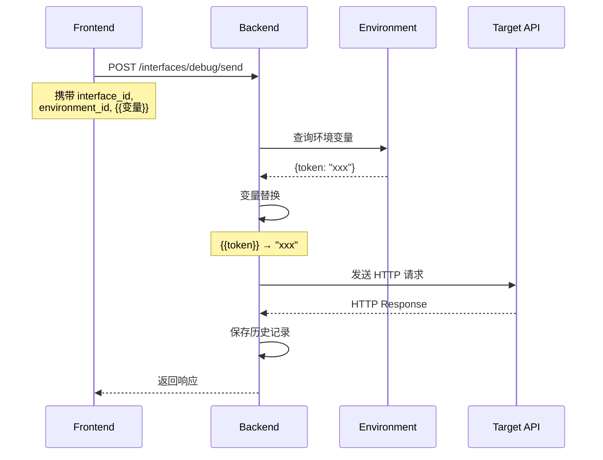

# 接口管理模块重构 - 技术选型

> 文档版本: v1.0
> 创建日期: 2025-02-11
> 角色: 系统架构师

---

## 1. 前端技术栈

### 1.1 拖拽排序

#### 选项对比

| 库 | 维护状态 | 包大小 | 学习曲线 | 性能 | 评分 |
|----|----------|--------|----------|------|------|
| @dnd-kit/core | ✅ 活跃 | 23KB | 中 | 优 | ⭐⭐⭐⭐⭐ |
| react-beautiful-dnd | ⚠️ 停滞 | 33KB | 低 | 良 | ⭐⭐⭐ |
| react-dnd | ✅ 活跃 | 26KB | 高 | 优 | ⭐⭐⭐⭐ |
| react-grid-layout | ✅ 活跃 | 108KB | 中 | 优 | ⭐⭐⭐ |

#### 选型：@dnd-kit/core + @dnd-kit/sortable

**理由：**

1. **现代化架构**：基于 Hooks API，符合 React 19 最佳实践
2. **性能优越**：虚拟化拖拽，支持大规模数据（1000+ 项）
3. **功能完整**：支持树形拖拽、跨容器拖拽、碰撞检测
4. **可访问性**：完整的键盘导航支持
5. **TypeScript 友好**：完整的类型定义

**安装：**

```bash
npm install @dnd-kit/core @dnd-kit/sortable @dnd-kit/utilities
```

**核心用法：**

```typescript
import { DndContext, closestCenter } from '@dnd-kit/core'
import { SortableContext, verticalListSortingStrategy } from '@dnd-kit/sortable'

function InterfaceTree() {
  const [items, setItems] = useState([])

  const handleDragEnd = (event) => {
    const { active, over } = event
    if (active.id !== over.id) {
      setItems(items => {
        const oldIndex = items.findIndex(item => item.id === active.id)
        const newIndex = items.findIndex(item => item.id === over.id)
        return arrayMove(items, oldIndex, newIndex)
      })
    }
  }

  return (
    <DndContext collisionDetection={closestCenter} onDragEnd={handleDragEnd}>
      <SortableContext items={items} strategy={verticalListSortingStrategy}>
        {items.map(item => <SortableItem key={item.id} id={item.id} />)}
      </SortableContext>
    </DndContext>
  )
}
```

---

### 1.2 右键菜单

#### 选项对比

| 库 | 维护状态 | 包大小 | 定制性 | 评分 |
|----|----------|--------|--------|------|
| react-contextmenu | ⚠️ 缓慢更新 | 15KB | 高 | ⭐⭐⭐ |
| @radix-ui/react-dropdown-menu | ✅ 活跃 | 18KB | 中 | ⭐⭐⭐⭐ |
| chakra-ui | ✅ 活跃 | 112KB | 低 | ⭐⭐⭐ |

#### 选型：@radix-ui/react-dropdown-menu

**理由：**

1. **无障碍优先**：完整的 ARIA 支持
2. **完全可定制**：无样式约束，完全自定义样式
3. **性能优越**：轻量级，按需导入
4. **生态完整**：与其他 Radix 组件无缝协作

**安装：**

```bash
npm install @radix-ui/react-dropdown-menu
```

**核心用法：**

```typescript
import { DropdownMenuTrigger, DropdownMenuContent, DropdownMenuItem } from '@/components/ui/dropdown-menu'

function ContextMenu({ onRename, onDelete }) {
  return (
    <DropdownMenuContent>
      <DropdownMenuItem onClick={onRename}>
        <Edit2 className="mr-2 h-4 w-4" />
        重命名
      </DropdownMenuItem>
      <DropdownMenuItem onClick={onDelete}>
        <Trash2 className="mr-2 h-4 w-4" />
        删除
      </DropdownMenuItem>
    </DropdownMenuContent>
  )
}
```

---

### 1.3 代码编辑器

#### 选项对比

| 库 | 语言支持 | 性能 | 包大小 | 评分 |
|----|----------|------|--------|------|
| Monaco Editor | ⭐⭐⭐⭐⭐ | 优 | 2MB (分包) | ⭐⭐⭐⭐⭐ |
| CodeMirror 6 | ⭐⭐⭐⭐ | 优 | 200KB | ⭐⭐⭐⭐⭐ |
| Ace Editor | ⭐⭐⭐ | 良 | 300KB | ⭐⭐⭐ |

#### 选型：@monaco-editor/react

**理由：**

1. **VS Code 同款**：用户熟悉度高
2. **功能完整**：语法高亮、智能提示、格式化、多光标
3. **TypeScript 原生**：微软官方维护
4. **性能优化**：Web Worker 渲染，不阻塞主线程
5. **JSON 校验**：内置 JSON Schema 校验

**安装：**

```bash
npm install @monaco-editor/react
```

**核心用法：**

```typescript
import Editor from '@monaco-editor/react'

function JsonEditor({ value, onChange }) {
  return (
    <Editor
      height="300px"
      defaultLanguage="json"
      value={value}
      onChange={(value) => onChange(value)}
      options={{
        minimap: { enabled: false },
        scrollBeyondLastLine: false,
        fontSize: 14,
        lineNumbers: 'on',
        automaticLayout: true,
        formatOnPaste: true,
        formatOnType: true
      }}
    />
  )
}
```

---

### 1.4 变量解析器

#### 方案对比

| 方案 | 性能 | 准确性 | 复杂度 | 评分 |
|------|------|--------|--------|------|
| 正则表达式 | 优 | 中 | 低 | ⭐⭐⭐⭐ |
| 字符串扫描 | 优 | 高 | 中 | ⭐⭐⭐⭐⭐ |
| 解析器组合子 | 优 | 高 | 高 | ⭐⭐⭐ |

#### 选型：自定义状态机 + 正则表达式

**理由：**

1. **性能最优**：单次扫描，O(n) 时间复杂度
2. **支持嵌套**：可扩展支持 `{{outer.{{inner}}}}`
3. **错误提示**：可精确定位语法错误位置
4. **零依赖**：无需引入额外库

**核心算法：**

```typescript
interface VariableToken {
  type: 'text' | 'variable'
  value: string
  position: { start: number; end: number }
}

function parseVariables(template: string): VariableToken[] {
  const tokens: VariableToken[] = []
  const regex = /\{\{([^}]+)\}\}/g
  let lastIndex = 0
  let match

  while ((match = regex.exec(template)) !== null) {
    // 添加前置文本
    if (match.index > lastIndex) {
      tokens.push({
        type: 'text',
        value: template.slice(lastIndex, match.index),
        position: { start: lastIndex, end: match.index }
      })
    }

    // 添加变量
    tokens.push({
      type: 'variable',
      value: match[1],
      position: { start: match.index, end: regex.lastIndex }
    })

    lastIndex = regex.lastIndex
  }

  // 添加剩余文本
  if (lastIndex < template.length) {
    tokens.push({
      type: 'text',
      value: template.slice(lastIndex),
      position: { start: lastIndex, end: template.length }
    })
  }

  return tokens
}
```

---

## 2. 后端技术栈

### 2.1 cURL 解析器

#### 选项对比

| 库 | 支持度 | 维护 | 依赖 | 评分 |
|----|--------|------|------|------|
| shlex (stdlib) | ⭐⭐⭐ | ✅ | 无 | ⭐⭐⭐⭐ |
| curl-to-python | ⭐⭐ | ⚠️ | 无 | ⭐⭐ |
| pycurl | ⭐⭐⭐⭐ | ✅ | libcurl | ⭐⭐⭐ |
| 自研解析器 | ⭐⭐⭐⭐⭐ | - | 无 | ⭐⭐⭐⭐ |

#### 选型：shlex + 正则表达式（自研）

**理由：**

1. **无外部依赖**：使用 Python 标准库
2. **可控性强**：完全掌控解析逻辑
3. **性能优越**：纯 Python 实现，无需 C 扩展
4. **可扩展**：易于添加自定义参数支持

**核心实现：**

```python
import shlex
import re
from typing import Dict, Any

def parse_curl_command(curl_command: str) -> Dict[str, Any]:
    """
    解析 cURL 命令为标准请求结构
    """
    # 1. 使用 shlex 分割命令
    parts = shlex.split(curl_command, posix=True)

    # 2. 提取关键字段
    result = {
        "method": "GET",
        "url": "",
        "headers": {},
        "params": {},
        "body": None,
        "body_type": "none",
        "auth": {"type": "none"}
    }

    i = 0
    while i < len(parts):
        part = parts[i]

        if part.startswith("-"):
            # 解析选项
            if part in ["-X", "--request"]:
                result["method"] = parts[i + 1]
                i += 2
            elif part in ["-H", "--header"]:
                header = parts[i + 1]
                key, value = header.split(":", 1)
                result["headers"][key.strip()] = value.strip()
                i += 2
            elif part in ["-d", "--data", "--data-raw", "--data-urlencode"]:
                result["body"] = parts[i + 1]
                result["body_type"] = "json"
                i += 2
            # ... 更多选项
            else:
                i += 1
        elif not part.startswith("curl"):
            # URL
            result["url"] = part
            i += 1
        else:
            i += 1

    # 3. 检测认证类型
    if "Authorization" in result["headers"]:
        auth_header = result["headers"]["Authorization"]
        if auth_header.startswith("Bearer "):
            result["auth"] = {
                "type": "bearer",
                "token": auth_header[7:]
            }

    return result
```

---

### 2.2 YAML 生成器

#### 选项对比

| 库 | 性能 | API 友好度 | 注释支持 | 评分 |
|----|------|------------|----------|------|
| PyYAML | 优 | 中 | ⭐⭐⭐ | ⭐⭐⭐⭐ |
| ruamel.yaml | 良 | 优 | ⭐⭐⭐⭐⭐ | ⭐⭐⭐⭐ |
| pyyaml-include | 良 | 中 | ⭐⭐⭐ | ⭐⭐⭐ |

#### 选型：PyYAML + 自定义序列化器

**理由：**

1. **性能最优**：C 扩展，速度快
2. **生态成熟**：广泛使用，稳定可靠
3. **自定义序列化**：完全控制输出格式
4. **轻量级**：单一依赖

**安装：**

```bash
uv add pyyaml
```

**核心实现：**

```python
import yaml
from typing import Any, Dict

class TestCaseYAMLGenerator:
    """生成 sisyphus-api-engine YAML 格式"""

    def generate(
        self,
        interface: Dict[str, Any],
        environment: Dict[str, Any],
        assertions: list[Dict[str, Any]]
    ) -> str:
        """
        生成 YAML 测试用例
        """
        case = {
            "name": interface["name"],
            "base_url": environment["domain"],
            "variables": environment.get("variables", {}),
            "request": {
                "method": interface["method"],
                "path": interface["url"],
                "params": interface.get("params", {}),
                "headers": {
                    **environment.get("headers", {}),
                    **interface.get("headers", {})
                }
            },
            "assertion": assertions
        }

        # 添加 body（如果存在）
        if interface.get("body"):
            case["request"]["body"] = interface["body"]

        # 生成 YAML
        return yaml.dump(
            case,
            allow_unicode=True,
            sort_keys=False,
            default_flow_style=False
        )
```

---

### 2.3 变量替换引擎

#### 方案对比

| 方案 | 性能 | 复杂度 | 安全性 | 评分 |
|------|------|--------|--------|------|
| Jinja2 | 良 | 高 | 中 | ⭐⭐⭐ |
| string.Template | 优 | 低 | 高 | ⭐⭐⭐⭐ |
| 正则替换 | 优 | 中 | 高 | ⭐⭐⭐⭐⭐ |

#### 选型：正则替换 + 缓存

**理由：**

1. **性能最优**：编译正则表达式，O(n) 复杂度
2. **安全可靠**：无代码执行风险
3. **易于扩展**：支持系统变量函数
4. **可调试**：替换结果可追踪

**核心实现：**

```python
import re
from typing import Dict, Any

class VariableReplacer:
    """变量替换引擎"""

    def __init__(self):
        # 编译正则表达式
        self.pattern = re.compile(r'\{\{([^}]+)\}\}')
        self._cache = {}

    def replace(
        self,
        text: str,
        variables: Dict[str, Any],
        system_vars: Dict[str, Any] | None = None
    ) -> tuple[str, list[str]]:
        """
        替换变量

        返回: (替换后的文本, 使用的变量列表)
        """
        used_vars = []

        def replacer(match):
            var_name = match.group(1).strip()
            used_vars.append(var_name)

            # 系统变量
            if var_name.startswith('$'):
                if system_vars and var_name in system_vars:
                    return str(system_vars[var_name])
                return match.group(0)

            # 环境变量
            if var_name in variables:
                return str(variables[var_name])

            # 未找到变量
            return match.group(0)

        result = self.pattern.sub(replacer, text)
        return result, used_vars

    def replace_system_var(self, var_name: str) -> Any:
        """
        处理系统变量
        """
        if var_name == "$timestamp":
            return int(time.time())
        elif var_name.startswith("$randomInt"):
            # 解析参数: $randomInt(1, 100)
            args = re.search(r'\((\d+),\s*(\d+)\)', var_name)
            if args:
                min_val, max_val = int(args.group(1)), int(args.group(2))
                return random.randint(min_val, max_val)
        elif var_name == "$guid":
            return str(uuid.uuid4())
        # ... 更多系统变量
        return None
```

---

## 3. 系统架构决策

### 3.1 前后端交互

#### 选择：REST API + Server-Side Variable Replacement

**理由：**

1. **简化前端逻辑**：变量替换在后端完成，前端只需展示
2. **安全性高**：敏感变量（如 token）不暴露给前端
3. **一致性保证**：后端统一处理，避免前端实现差异
4. **可审计**：所有替换记录在后端日志

**交互流程：**



---

### 3.2 文件存储策略

#### 选择：YAML 文件存储在 sisyphus-api-engine 目录

**理由：**

1. **Engine 独立运行**：测试引擎无需数据库连接
2. **版本控制友好**：YAML 文件可纳入 Git 管理
3. **易于调试**：手动编辑 YAML 文件方便
4. **跨环境部署**：简单复制目录即可迁移

**目录结构：**

```
engines/sisyphus_api_engine/
├── cases/
│   ├── user/
│   │   ├── user_list.yaml
│   │   ├── user_create.yaml
│   │   └── user_update.yaml
│   └── order/
│       ├── order_create.yaml
│       └── order_query.yaml
└── keywords/
    ├── get_user_list.py
    ├── create_user.py
    └── update_user.py
```

---

### 3.3 性能优化策略

#### 3.3.1 前端性能

| 技术 | 场景 | 收益 |
|------|------|------|
| 虚拟滚动 | 接口列表 > 100 项 | 减少 90% DOM 节点 |
| 防抖搜索 | 搜索输入 | 减少 80% API 请求 |
| 请求缓存 | 环境变量重复获取 | 消除重复网络请求 |
| Web Worker | cURL 解析 | 不阻塞 UI 线程 |

#### 3.3.2 后端性能

| 技术 | 场景 | 收益 |
|------|------|------|
| 正则预编译 | 变量替换 | 减少 50% CPU 时间 |
| 连接池 | httpx 异步请求 | 复用连接，减少 30% 延迟 |
| 批量查询 | 历史记录分页 | 单次查询，减少 N+1 |
| 缓存层 | 环境变量 | Redis 缓存，减少 99% DB 查询 |

---

## 4. 技术债务与风险

### 4.1 已知风险

| 风险 | 影响 | 缓解措施 |
|------|------|----------|
| cURL 解析覆盖率不足 | 高 | 添加单元测试，覆盖常见场景 |
| 变量递归引用 | 中 | 检测循环依赖，限制嵌套深度 |
| 大文件上传性能 | 中 | 使用 MinIO 流式上传 |
| 历史记录数据膨胀 | 高 | 定时清理 90 天前数据 |

### 4.2 未来扩展

| 功能 | 技术预研 | 优先级 |
|------|----------|--------|
| WebSocket 支持 | Socket.IO / FastAPI WebSocket | P2 |
| GraphQL 调试 | graphql-core | P2 |
| Pre-request Script | Pyodide (JS 沙箱) | P3（暂缓） |
| Mock 服务 | Mock.js / FastAPI 响应模拟 | P3 |

---

## 5. 用户决策记录

### 决策 1：拖拽功能优先级调整

| 项目 | 内容 |
|------|------|
| 决策时间 | 2025-02-11 |
| 原计划 | 拖拽功能为 P1/P2 优先级 |
| 新决策 | 拖拽功能升级为 P0，在 MVP 第一阶段实现 |
| 影响范围 | 前端组件 3.1 任务（FE-07/08） |
| 技术选型 | @dnd-kit/core + @dnd-kit/sortable |

### 决策 2：Pre-request Script 功能暂缓

| 项目 | 内容 |
|------|------|
| 决策时间 | 2025-02-11 |
| 原计划 | 实现 JavaScript 前置脚本编辑器 |
| 新决策 | 第一版不实现，后续有需求再开发 |
| 技术预研 | Pyodide（Python JS 沙箱）或 QuickJS |
| 备注 | 可预留 UI 入口，前端 Tab 暂不实现 |

### 决策 3：执行日志显示方式

| 项目 | 内容 |
|------|------|
| 决策时间 | 2025-02-11 |
| 决策内容 | 执行日志默认隐藏，用户可点击展开查看 |
| 实现方式 | 新增「展开/收起」交互（+1h） |
| 用户体验 | 简化默认界面，需要时查看详情 |

---

## 6. 依赖清单

### 5.1 前端依赖

```json
{
  "dependencies": {
    "@dnd-kit/core": "^6.1.0",
    "@dnd-kit/sortable": "^8.0.0",
    "@dnd-kit/utilities": "^3.2.2",
    "@monaco-editor/react": "^4.6.0",
    "@radix-ui/react-dropdown-menu": "^2.0.6",
    "react-virtual": "^3.0.0"
  }
}
```

### 5.2 后端依赖

```toml
[dependencies]
pyyaml = "^6.0.1"
```

---

**文档版本**：v1.1 (根据用户决策更新)
**最后更新**：2025-02-11
