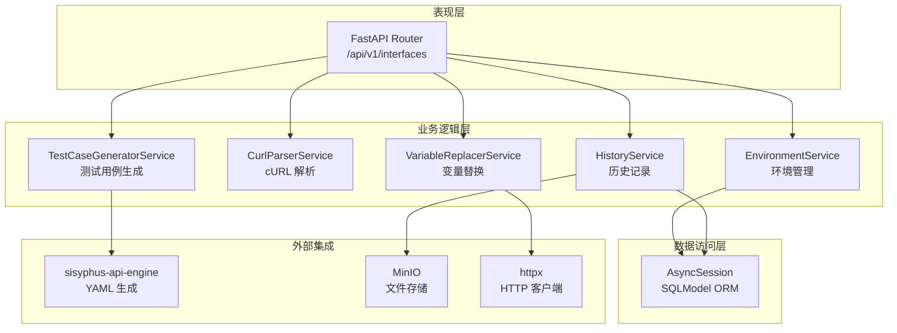
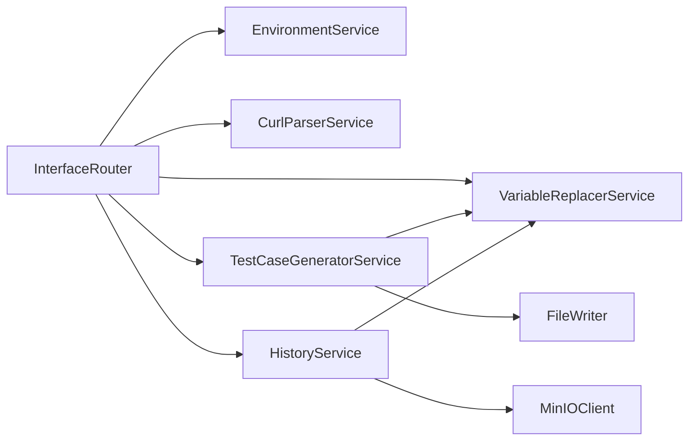
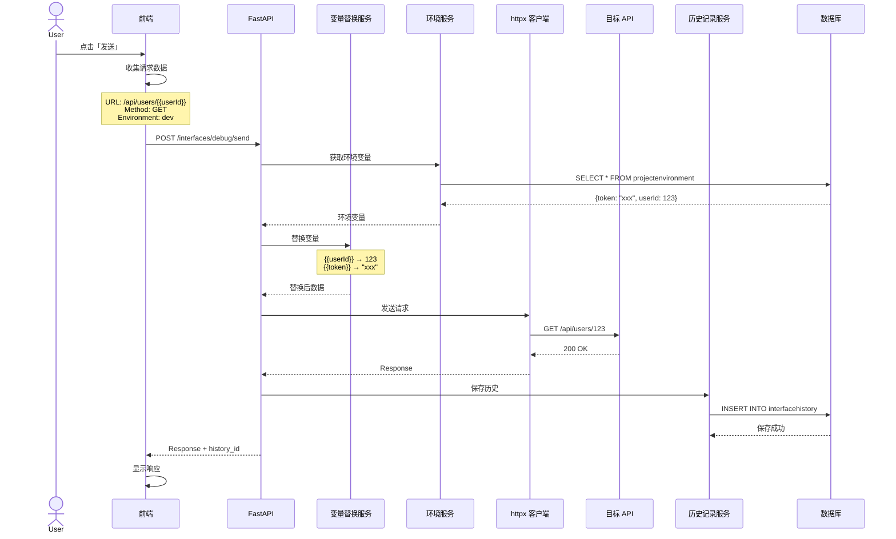
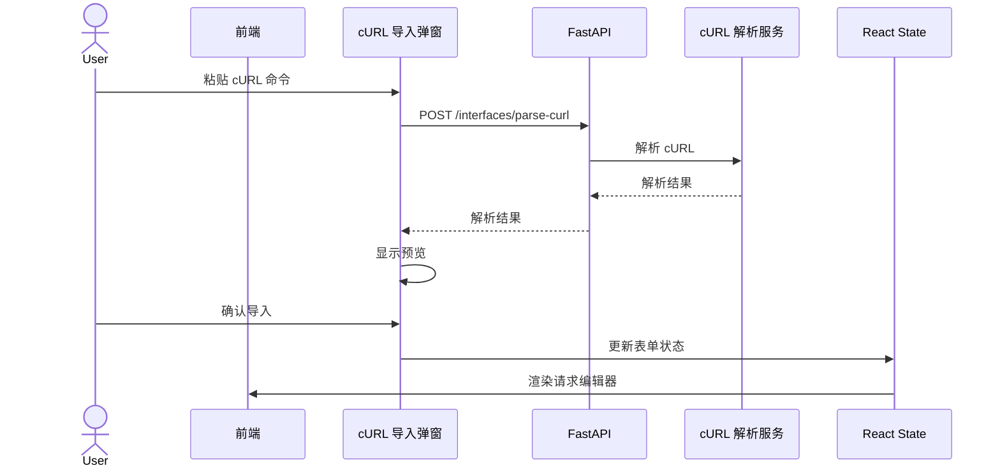
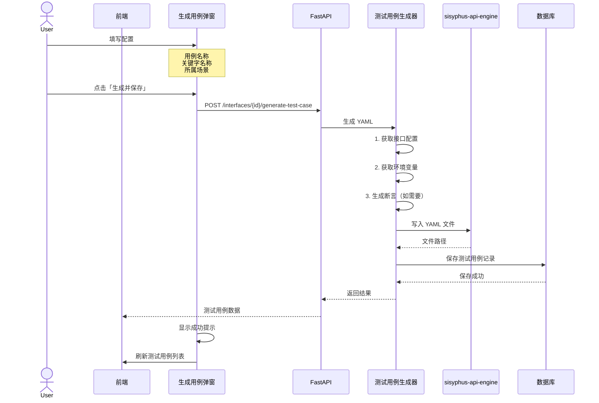
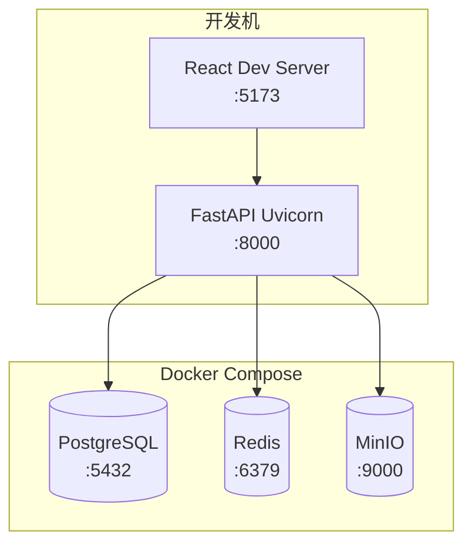
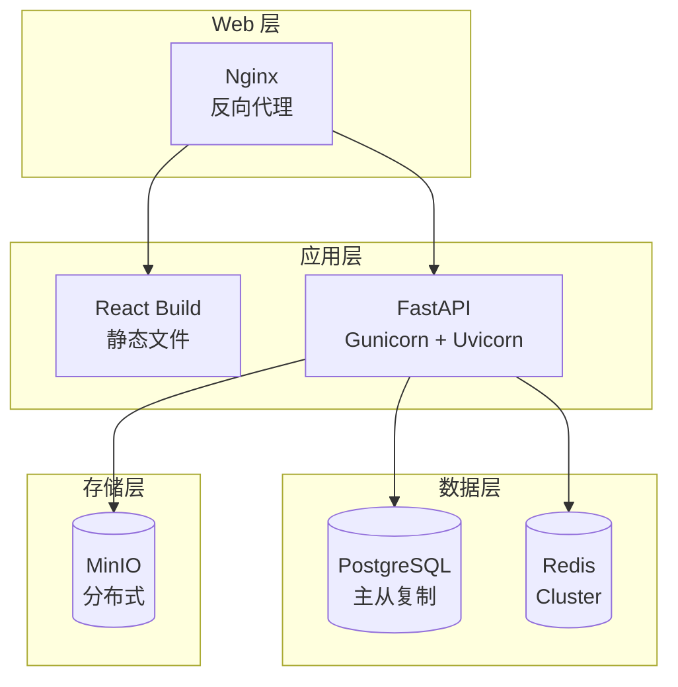
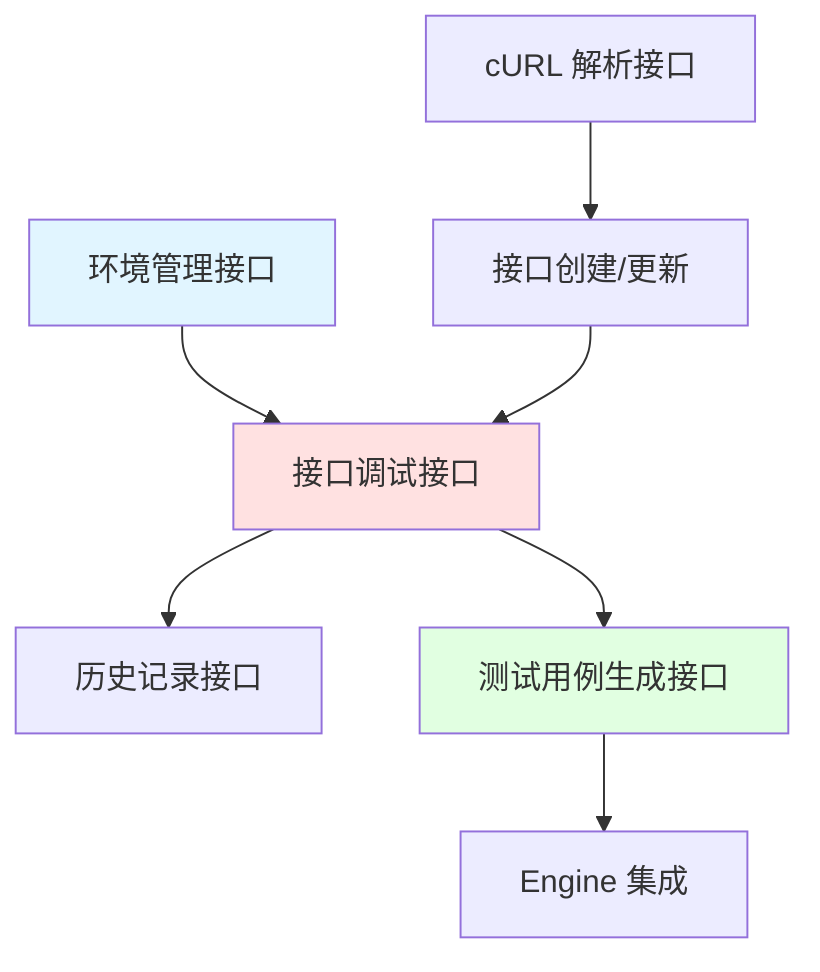

# 接口管理模块重构 - 系统架构图

> 文档版本: v1.0
> 创建日期: 2025-02-11
> 角色: 系统架构师

---

## 1. 系统架构总览

```mermaid
graph TB
    subgraph Frontend["前端 React"]
        UI["用户界面"]
        State["状态管理<br/>React Query"]
        Hook["自定义 Hooks<br/>useEnvironment<br/>useVariableReplacement"]
    end

    subgraph Backend["后端 FastAPI"]
        API["REST API<br/>/api/v1/interfaces"]
        Services["服务层"]
        DB[(("数据库<br/>PostgreSQL/SQLite"))]
        Engine["测试引擎<br/>sisyphus-api-engine"]
    end

    subgraph External["外部服务"]
        MinIO["MinIO<br/>文件存储"]
        TargetAPI["目标 API<br/>被测接口"]
    end

    UI --> State
    State --> Hook
    Hook --> API
    API --> Services
    Services --> DB
    Services --> Engine
    Services --> MinIO
    Services --> TargetAPI
```

---

## 2. 前端架构

### 2.1 组件层次结构

```
frontend/src/pages/interface/
├── index.tsx                          # 布局容器
│   └── <InterfacePage>
│
├── components/
│   ├── InterfaceTree.tsx              # 左侧目录树
│   │   ├── <TreeNode>
│   │   ├── <ContextMenu>
│   │   └── <SearchInput>
│   │
│   ├── WelcomeCards.tsx               # 欢迎卡片
│   │   ├── <NewRequestCard>
│   │   ├── <ImportCurlCard>
│   │   └── <RecentInterfaces>
│   │
│   ├── RequestEditor/                 # 请求编辑器
│   │   ├── RequestEditor.tsx          # 容器组件
│   │   ├── MethodSelector.tsx        # 方法选择器
│   │   ├── UrlInput.tsx              # URL 输入框
│   │   ├── EnvironmentSelector.tsx   # 环境选择器
│   │   ├── KeyValueEditor.tsx        # 通用 KV 编辑器
│   │   │
│   │   └── tabs/
│   │       ├── ParamsTab.tsx         # Query 参数编辑器
│   │       ├── AuthTab.tsx           # 认证配置编辑器
│   │       ├── HeadersTab.tsx        # Headers 编辑器
│   │       ├── BodyTab.tsx           # Body 编辑器
│   │       │   ├── <NoneBody>
│   │       │   ├── <JsonBody>        # Monaco Editor
│   │       │   ├── <FormDataBody>    # KV 编辑器
│   │       │   ├── <UrlEncodedBody>  # KV 编辑器
│   │       │   └── <RawBody>        # Monaco Editor
│   │       └── PreRequestTab.tsx     # 前置脚本编辑器（未来）
│   │
│   └── ResponseViewer/               # 响应展示器
│       ├── ResponseViewer.tsx        # 容器组件
│       ├── ResponseHeader.tsx        # 响应头
│       │   ├── <StatusCodeBadge>
│       │   └── <MetaInfo>
│       │
│       └── tabs/
│           ├── BodyViewer.tsx         # Body 展示器
│           │   ├── <JsonViewer>      # 格式化 JSON
│           │   ├── <TextViewer>      # 纯文本
│           │   └── <ImageViewer>     # 图片预览
│           ├── HeadersViewer.tsx     # Headers 表格
│           ├── CookiesViewer.tsx     # Cookies 表格
│           ├── TimelineViewer.tsx    # 时间线可视化
│           └── TestResultsViewer.tsx # 断言结果（未来）
│
├── dialogs/
│   ├── EnvironmentDialog.tsx          # 环境管理弹窗
│   ├── CurlImportDialog.tsx          # cURL 导入弹窗
│   └── GenerateCaseDialog.tsx        # 生成测试用例弹窗
│
├── hooks/
│   ├── useVariableReplacement.ts      # 变量替换 Hook
│   ├── useRequestHistory.ts          # 请求历史 Hook
│   └── useEnvironment.ts             # 环境管理 Hook
│
└── utils/
    ├── curlParser.ts                 # cURL 前端解析器
    └── variableParser.ts             # 变量解析器
```

---

### 2.2 状态管理

```mermaid
graph LR
    subgraph Client["客户端状态"]
        Local["局部状态<br/><input>, <select>"]
        Global["全局状态<br/>Context/Zustand"]
        Server["服务端状态<br/>React Query"]
    end

    subgraph Storage["本地存储"]
        LS["localStorage<br/>展开状态"]
    end

    Local --> Global
    Global --> Server
    Global <--> LS
```



**状态划分：**

| 类型 | 状态 | 管理方式 |
|------|------|----------|
| 局部 | 输入框值、Tab 选择、对话框状态 | useState |
| 全局 | 当前选中接口、当前环境 | React Context |
| 服务端 | 接口列表、环境列表、历史记录 | React Query |
| 持久化 | 目录树展开状态 | localStorage |

---

## 3. 后端架构

### 3.1 分层架构



---

### 3.2 服务依赖关系



---

## 4. 数据流设计

### 4.1 发送接口请求流程



---

### 4.2 cURL 导入流程



---

### 4.3 测试用例生成流程



---

## 5. 部署架构

### 5.1 开发环境



---

### 5.2 生产环境



---

## 6. 技术栈矩阵

| 层级 | 技术 | 版本 | 用途 |
|------|------|------|------|
| 前端框架 | React | 19.2 | UI 框架 |
| 前端语言 | TypeScript | 5.9 | 类型安全 |
| 构建工具 | Vite | 7.2 | 开发服务器 |
| 状态管理 | React Query | 5.0 | 服务端状态 |
| 拖拽 | @dnd-kit | 6.1 | 拖拽排序 |
| 代码编辑 | Monaco | 4.6 | JSON/YAML 编辑 |
| 后端框架 | FastAPI | 0.115+ | API 框架 |
| 后端语言 | Python | 3.12+ | 后端逻辑 |
| ORM | SQLModel | 0.0.22 | 数据库 ORM |
| 数据库 | PostgreSQL | 16 | 生产数据库 |
| 数据库 | SQLite | 3.45 | 开发数据库 |
| 缓存 | Redis | 7.2 | 缓存层 |
| 对象存储 | MinIO | RELEASE.2024 | 文件存储 |
| HTTP 客户端 | httpx | 0.27+ | 异步请求 |
| 任务调度 | APScheduler | 3.10+ | 定时任务 |
| 容器化 | Docker | 26+ | 容器运行时 |
| 进程管理 | Gunicorn | 23+ | WSGI 服务器 |

---

## 7. 接口依赖关系图



---

## 8. 前端交互设计

### 8.1 执行日志展示（按需显示）

根据用户决策，执行日志采用「默认隐藏，按需展开」的设计。

**交互流程：**

```
┌─────────────────────────────────────────────────────────────┐
│ Response                              [200 OK]  [125ms]  │
├─────────────────────────────────────────────────────────────┤
│ [Body] [Headers] [Cookies] [Timeline]                    │
├─────────────────────────────────────────────────────────────┤
│ {                                                          │
│   "code": 0,                                               │
│   "data": {...}                                             │
│ }                                                          │
│                                                      [展开日志 ▼] │
└─────────────────────────────────────────────────────────────┘
                            ↓ 点击展开
┌─────────────────────────────────────────────────────────────┐
│ Response                              [200 OK]  [125ms]  │
├─────────────────────────────────────────────────────────────┤
│ [Body] [Headers] [Cookies] [Timeline] [执行日志]        │
├─────────────────────────────────────────────────────────────┤
│ {                                                          │
│   "code": 0,                                               │
│   "data": {...}                                             │
│ }                                                          │
├─────────────────────────────────────────────────────────────┤
│ 执行日志                                        [收起 ▲] │
│ ┌──────────────────────────────────────────────────────┐   │
│ │ [14:30:25.123] 开始发送请求                        │   │
│ │ [14:30:25.145] 环境变量替换完成                   │   │
│ │ [14:30:25.167] DNS 查询完成: 22ms                  │   │
│ │ [14:30:25.189] TCP 连接完成: 24ms                  │   │
│ │ [14:30:25.234] 首字节接收: 45ms                   │   │
│ │ [14:30:25.248] 响应接收完成: 125ms                │   │
│ └──────────────────────────────────────────────────────┘   │
└─────────────────────────────────────────────────────────────┘
```

**实现要点：**

| 组件 | 状态 | 说明 |
|------|------|------|
| ResponseViewer | 默认 | 不显示「执行日志」Tab |
| ResponseViewer | 展开状态 | 新增「执行日志」Tab |
| 展开按钮 | 条件显示 | 仅在有执行日志时显示 |
| 日志内容 | 只读 | 从后端 timeline 数据生成 |

**前端代码位置：**
- `frontend/src/pages/interface-refactor/components/ResponseViewer/ResponseViewer.tsx`
- 新增 `ExecutionLogViewer.tsx` 组件（待实现）

**后端数据来源：**
- `interfacehistory.timeline` 字段
- 包含 DNS/TCP/TTFB/Download 时间数据

---

## 9. 用户决策说明

| 决策项 | 设计实现 | 状态 |
|--------|----------|------|
| 拖拽功能 P0 | 使用 @dnd-kit 实现完整拖拽排序 | ✅ 已实现 |
| Pre-request Script | 预留 UI 入口，暂不实现 | ✅ 已预留 |
| 执行日志按需显示 | 默认隐藏，支持展开/收起 | ⚠️ 待实现 |

---

**文档版本**：v1.2 (补充执行日志交互设计)
**最后更新**：2025-02-11
